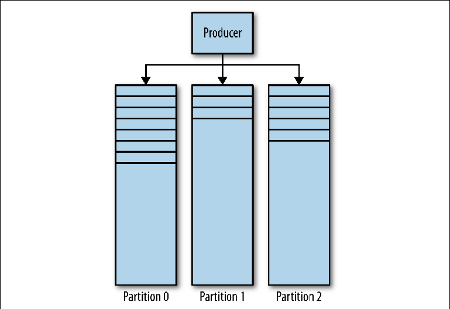
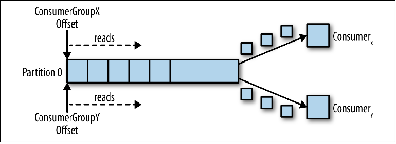

# Kafka

Kafka была разработана в LinkedIn для того, чтобы обойти некоторые ограничения традиционных брокеров сообщений и избежать необходимости настраивать несколько брокеров сообщений для разных взаимодействий «точка-точка», что описано в данной книге в разделе «Вертикальное и горизонтальное масштабирование» на странице 28. Сценарии использования в LinkedIn в основном основывались на однонаправленном поглощении очень больших объемов данных, таких как клики на страницах и журналы доступа, в то же время позволяя использовать эти данные нескольким системам, не влияя на производительность продюсеров или других консюмеров. Фактически, причина существования Kafka заключается в том, чтобы получить такую архитектуру обмена сообщениями, которую описывает Universal Data Pipeline.

С учетом этой конечной цели, естественно, возникли и другие требования. Kafka должна:

* Быть чрезвычайно быстрой
* Предоставлять большую пропускную способность при работе с сообщениями
* Поддерживать модели «Издатель-Подписчик» и «Точка-Точка»
* Не замедляться с добавлением потребителей. Например, производительность и очереди, и топика в ActiveMQ ухудшается при росте количества потребителей на адресате
* Быть горизонтально масштабируемой; если один брокер, сохраняющий (persists) сообщения, может делать это только на максимальной скорости диска, то для увеличения производительности имеет смысл выйти за пределы одного экземпляра брокера
* Разграничивать доступ к хранению и повторному извлечению сообщений

Чтобы достигнуть всего этого, в Kafka принята архитектура, которая переопределила роли и обязанности клиентов и брокеров обмена сообщениями. Модель ___JMS___ очень ориентирована на брокер, где он отвечает за распространение сообщений, а клиенты должны беспокоиться только об отправке и получении сообщений. Kafka, с другой стороны, ориентирована на клиента, при этом клиент берет на себя многие функции традиционного брокера, такие как справедливое распределение соответствующих сообщений среди потребителей, в обмен получая чрезвычайно быстрый и масштабируемый брокер. Для людей, работавших с традиционными системами обмена сообщениями, работа с Kafka требует фундаментальных изменений во взглядах.
Это инженерное направление привело к созданию инфраструктуры обмена сообщениями, способной на много порядков увеличить пропускную способность по сравнению с обычным брокером. Как мы увидим, этот подход сопряжен с компромиссами, которые означают, что Kafka не подходит для определенных типов нагрузок и установленного ПО.

## Унифицированная модель адресата

Чтобы выполнить требования, описанные выше, Kafka объединила обмен сообщениями типа «публикация-подписка» и «точка-точка» в рамках одного вида адресата — топика. Это сбивает с толку людей, работавших с системами обмена сообщениями, где слово «топик» относится к широковещательному механизму, из которого (из топика) чтение не является надежным (is nondurable). Топики Kafka следует рассматривать как гибридный тип адресата, в соответствии с определением, данным во введении к этой книге.

    В оставшейся части этой статьи, если мы явно не укажем иное, термин «топик» будет относиться к топику Kafka.

Чтобы полностью понять, как ведут себя топики и какие гарантии они предоставляют, нам нужно сначала рассмотреть, как они реализованы в Kafka.
У каждого топика в Kafka есть свой журнал.
Продюсеры, отправляющие сообщения в Kafka, дописывают в этот журнал, а консюмеры читают из журнала с помощью указателей, которые постоянно перемещаются вперед. Периодически Kafka удаляет самые старые части журнала, независимо от того, были ли сообщения в этих частях прочитаны или нет. Центральной частью дизайна Kafka является то, что брокер не заботится о том, прочитаны ли сообщения или нет — это ответственность клиента.

    Термины «журнал» и «указатель» не встречаются в документации Kafka. Эти хорошо известные термины используются здесь, чтобы помочь пониманию.

Эта модель полностью отличается от ___ActiveMQ___, где сообщения из всех очередей хранятся в одном журнале, а брокер помечает сообщения, как удаленные, после того как они были прочитаны.
Давайте теперь немного углубимся и рассмотрим журнал топика более подробно.
Журнал Kafka состоит из нескольких партиций. Kafka гарантирует строгую упорядоченность в каждой партиции. Это означает, что сообщения, записанные в партицию в определенном порядке, будут прочитаны в том же порядке. Каждая партиция реализована в виде цикличного (rolling) файла журнала, который содержит подмножество (subset) всех сообщений, отправленных в топик его продюсерами. Созданный топик содержит по умолчанию одну партицию. Идея партиций — это центральная идея Kafka для горизонтального масштабирования.

_Когда продюсер отправляет сообщение в топик Kafka, он решает, в какую партицию отправить сообщение. Мы рассмотрим это более подробно позже._

## Чтение сообщений

Клиент, который хочет прочитать сообщения, управляет именованным указателем, называемым группа консюмеров (___consumer group___), который указывает на смещение (offset) сообщения в партиции. Смещение — это позиция с возрастающим номером, которая начинается с 0 в начале партиции. Эта группа консюмеров, на которую ссылаются в API через определяемый пользователем идентификатор group_id, соответствует одному логическому потребителю или системе.

Большинство систем, использующих обмен сообщениями, читают данные из адресата посредством нескольких экземпляров и потоков для параллельной обработки сообщений. Таким образом, обычно будет много экземпляров консюмеров, совместно использующих одну и ту же группу консюмеров.

Проблему чтения можно представить следующим образом:

* Топик имеет несколько партиций
* Использовать топик может одновременно множество групп консюмеров
* Группа консюмеров может иметь несколько отдельных экземпляров

Это нетривиальная проблема «многие ко многим». Чтобы понять, как Kafka обращается с отношениями между группами консюмеров, экземплярами консюмеров и партициями, рассмотрим ряд постепенно усложняющихся сценариев чтения.

## Консюмеры и группы консюмеров

Давайте возьмем в качестве отправной точки топик с одной партиций.

Когда экземпляр консюмера подключается со своим собственным group_id к этому топику, ему назначается партиция для чтения и смещение в этой партиции. Положение этого смещения конфигурируется в клиенте, как указатель на самую последнюю позицию (самое новое сообщение) или самую раннюю позицию (самое старое сообщение). Консюмер запрашивает (polls) сообщения из топика, что приводит к их последовательному чтению из журнала.
Позиция смещения регулярно коммитится обратно в Kafka и сохраняется, как сообщения во внутреннем топике _consumer_offsets. Прочитанные сообщения все равно не удаляются, в отличие от обычного брокера, и клиент может перемотать (rewind) смещение, чтобы повторно обработать уже просмотренные сообщения.

Когда подключается второй логический консюмер, используя другой group_id, он управляет вторым указателем, который не зависит от первого (Figure 3-3). Таким образом, топик Kafka действует как очередь, в которой существует один консюмер и, как обычный топик издатель-подписчик (pub-sub), на который подписаны несколько консюмеров, с дополнительным преимуществом, что все сообщения сохраняются и могут обрабатываться несколько раз.

## Консюмеры в группе консюмеров

Когда один экземпляр консюмера читает данные из партиции, он полностью контролирует указатель и обрабатывает сообщения, как описано в предыдущем разделе.
Если несколько экземпляров консюмеров были подключены с одним и тем же group_id к топику с одной партицией, то экземпляру, который подключился последним, будет передан контроль над указателем и с этого момента он будет получать все сообщения (Figure 3-4).

Этот режим обработки, в котором количество экземпляров консюмеров превышает число партиций, можно рассматривать как разновидность монопольного потребителя. Это может быть полезно, если вам нужна «активно-пассивная» (или «горячая-теплая») кластеризация ваших экземпляров консюмеров, хотя параллельная работа нескольких консюмеров («активно-активная» или «горячая-горячая») намного более типична, чем консюмеры в режиме ожидания.

Чаще всего, когда мы создаем несколько экземпляров консюмеров, мы делаем это либо для параллельной обработки сообщений, либо для увеличения скорости чтения, либо для повышения устойчивости процесса чтения. Поскольку читать данные из партиции может одновременно только один экземпляр консюмера, то как это достигается в Kafka?

Один из способов сделать это — использовать один экземпляр консюмера, чтобы прочитать все сообщения и передать их в пул потоков. Хотя этот подход увеличивает пропускную способность обработки, он увеличивает сложность логики консюмеров и ничего не делает для повышения устойчивости системы чтения. Если один экземпляр консюмера отключается из-за сбоя питания или аналогичного события, то вычитка прекращается.

Каноническим способом решения этой проблемы в Kafka является использование бОльшего количества партиций.

## Партиционирование

Партиции являются основным механизмом распараллеливания чтения и масштабирования топика за пределы пропускной способности одного экземпляра брокера. Чтобы лучше понять это, давайте рассмотрим ситуацию, когда существует топик с двумя партициями и на этот топик подписывается один консюмер.

В этом сценарии консюмеру дается контроль над указателями, соответствующими его group_id в обоих партициях, и начинается чтение сообщений из обеих партиций.
Когда в этот топик добавляется дополнительный консюмер для того же group_id, Kafka переназначает (reallocate) одну из партиций с первого на второй консюмер. После чего каждый экземпляр консюмера будет вычитывать из одной партиции топика (Figure 3-6).

Чтобы обеспечить обработку сообщений параллельно в 20 потоков, вам потребуется как минимум 20 партиций. Если партиций будет меньше, у вас останутся консюмеры, которым не над чем работать, что описано ранее в обсуждении монопольных консюмеров.

Эта схема значительно снижает сложность работы брокера Kafka. Здесь не нужно заботится о следующих моментах:

* Какой консюмер должен получить следующее сообщение, основываясь на циклическом (round-robin) распределении, текущей емкости буферов предварительной выборки или предыдущих сообщениях.
* Какие сообщения отправлены каким консюмерам и должны ли они быть доставлены повторно в случае сбоя.

Все, что должен сделать брокер Kafka — это последовательно передавать сообщения консюмеру, когда последний запрашивает их.

Однако, требования к распараллеливанию вычитки и повторной отправке неудачных сообщений никуда не деваются — ответственность за них просто переходит от брокера к клиенту. Это означает, что они должны быть учтены в вашем коде.

## Отправка сообщений

Ответственность за решение, в какую партицию отправить сообщение, возлагается на продюсер этого сообщения. Чтобы понять механизм, с помощью которого это делается, сначала нужно рассмотреть, что именно мы на самом деле отправляем.

В Kafka сообщение является парой «ключ-значение». Полезная нагрузка сообщения отправляется, как значение (value). Ключ, с другой стороны, используется главным образом для партиционирования и должен содержать специфичный для бизнес-логики ключ, чтобы поместить связанные сообщений в ту же партицию.

Если каждое событие представляет собой сообщение, отправленное в топик, то в этом случае естественным ключом будет идентификатор учетной записи.
Когда сообщение отправляется с использованием Kafka Producer API, оно передается функции партиционирования, которая, учитывая сообщение и текущее состояние кластера Kafka, возвращает идентификатор партиции, в которую должно быть отправлено сообщение.

## Высокая доступность (High Availability)

Подход Kafka в отношении высокой доступности существенно отличается от подхода ActiveMQ. Kafka разработана на базе горизонтально масштабируемых кластеров, в которых все экземпляры брокера принимают и раздают сообщения одновременно.

Кластер Kafka состоит из нескольких экземпляров брокера, работающих на разных серверах. Kafka была разработана для работы на обычном автономном железе, где каждый узел имеет свое собственное выделенное хранилище. Использование сетевых хранилищ (SAN) не рекомендуется, поскольку множественные вычислительные узлы могут конкурировать за временнЫе интервалы хранилища и создавать конфликты.

Kafka — это постоянно включенная система. Многие крупные пользователи Kafka никогда не гасят свои кластеры и программное обеспечение всегда обеспечивает обновление путем последовательного рестарта. Это достигается за счет гарантирования совместимости с предыдущей версией для сообщений и взаимодействий между брокерами.

Брокеры подключены к кластеру серверов ZooKeeper, который действует, как реестр конфигурационных данный и используется для координации ролей каждого брокера. ZooKeeper сам является распределенной системой, которая обеспечивает высокую доступность посредством репликации информации путем установления кворума.

В базовом случае топик создается в кластере Kafka со следующими свойствами:

* Количество партиций. Как обсуждалось ранее, точное значение, используемое здесь, зависит от желаемого уровня параллельного чтения.
* Коэффициент (фактор) репликации определяет, сколько экземпляров брокера в кластере должны содержать журналы для этой партиции.

Используя ZooKeepers для координации, Kafka пытается справедливо распределить новые партиции между брокерами в кластере. Это делается одним экземпляром, который выполняет роль Контроллера.

В рантайме для каждой партиции топика Контроллер назначает брокеру роли лидера (leader, master, ведущего) и последователей (followers, slaves, подчиненных). Брокер, выступающий в качестве лидера для данной партиции, отвечает за прием всех сообщений, отправленных ему продюсерами, и распространение сообщений по консюмерам. При отправке сообщений в партицию топика они реплицируются на все узлы брокера, выступающие в качестве последователей для этой партиции. Каждый узел, содержащий журналы для партиции, называется репликой. Брокер может выступать в качестве лидера для одних партиций и в качестве последователя для других.

Последователь, содержащий все сообщения, хранящиеся у лидера, называется синхронизированной репликой (репликой, находящейся в синхронизированном состоянии, in-sync replica). Если брокер, выступающий в качестве лидера для партиции, отключается, любой брокер, который находится в актуализированном или синхронизированном состоянии для этой партиции, может взять на себя роль лидера. Это невероятно устойчивый дизайн.

Частью конфигурации продюсера является параметр acks, который определяет, сколько реплик должно подтвердить (acknowledge) получение сообщения, прежде чем поток приложения продолжит отправку: 0, 1 или все. Если задано значение all, то при получении сообщения лидер отправит подтверждение (confirmation) обратно продюсеру, как только получит подтверждение (acknowledgements) записи от нескольких реплик (включая саму себя), определенных настройкой топика min.insync.replicas (по умолчанию 1). Если сообщение не может быть успешно реплицировано, то продюсер вызовет исключение для приложения (NotEnoughReplicas или NotEnoughReplicasAfterAppend).

В типичной конфигурации создается топик с коэффициентом репликации 3 (1 лидер, 2 последователя для каждой партиции) и параметр min.insync.replicas устанавливается в значение 2. В этом случае, кластер будет допускать, чтобы один из брокеров, управляющих партицией топика, мог отключаться без влияния на клиентские приложения.

Это возвращает нас к уже знакомому компромиссу между производительностью и надежностью. Репликация происходит за счет дополнительного времени ожидания подтверждений (acknowledgments) от последователей. Хотя, поскольку она выполняется параллельно, репликация, как минимум на три узла, имеет такую же производительность, как и на два (игнорируя увеличение использования пропускной способности сети).

Используя эту схему репликации, Kafka ловко избегает необходимости обеспечивать физическую запись каждого сообщения на диск с помощью операции ___sync()___. Каждое сообщение, отправленное продюсером, будет записано в журнал партиции, запись в файл первоначально выполняется в буфер операционной системы. Если это сообщение реплицировано на другой экземпляр Kafka и находится в его памяти, потеря лидера не означает, что само сообщение было потеряно — его может взять на себя синхронизированная реплика.
Отказ от необходимости выполнять операцию ___sync()___ означает, что Kafka может принимать сообщения со скоростью, с которой она может записывать их в память. И наоборот, чем дольше можно избежать сброса (flushing) памяти на диск, тем лучше. По этой причине нередки случаи, когда брокерам Kafka выделяется 64 Гб памяти или более. Такое использование памяти означает, что один экземпляр Kafka может легко работать на скоростях во много тысяч раз быстрее, чем традиционный брокер сообщений.

Kafka также можно настроить для применения операции ___sync() ___к пакетам сообщений. Поскольку всё в Kafka ориентировано на работу с пакетами, это на самом деле работает довольно хорошо для многих сценариев использования и является полезным инструментом для пользователей, которые требуют очень сильных гарантий. Большая часть чистой производительности Kafka связана с сообщениями, которые отправляются брокеру в виде пакетов, и с тем, что эти сообщения считываются из брокера последовательными блоками с помощью zero-copy операций (операциями, в ходе которых не выполняется задача копирования данных из одной области памяти в другую). Последнее является большим выигрышем с точки зрения производительности и ресурсов и возможно только благодаря использованию лежащей в основе структуры данных журнала, определяющей схему партиции.

В кластере Kafka возможна гораздо более высокая производительность, чем при использовании одного брокера Kafka, поскольку партиции топика могут горизонтально масштабироваться на множестве отдельных машин.