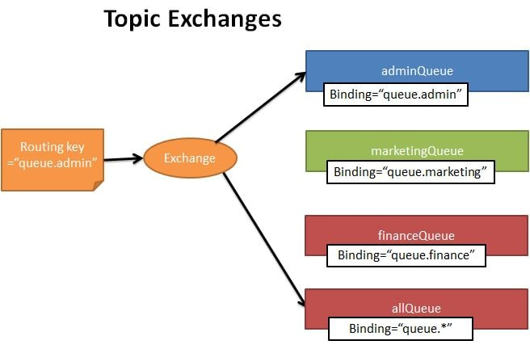
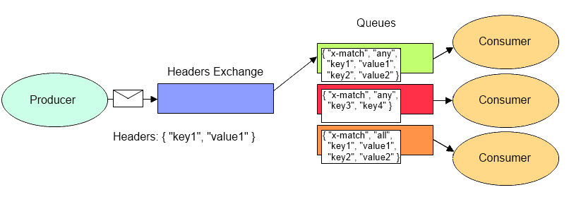

## Exchange

Exchanges - сущности [AMQP 0-9-1](init.md), в которые посылаются сообщения.

Типы по модели AMQP 0-9-1
* Direct
* Fanout
* Topic
* Headers (match)

Основные параметры exchange:
* Имя
* Долговечность (сохраняется ли после рестарта брокера) [durabilty]
* Автоудаление
* Аргументы (опциональные, используемые плагинами)

# Exchange по умолчанию

Exchange по умолчанию - direct без имени (пустая строка), предварительно объявленный брокером. У него есть одно особое свойство, которое делает его очень полезным для простых приложений: каждая создаваемая очередь автоматически привязывается к ней с помощью ключа маршрутизации, который совпадает с именем очереди.

Например, когда вы объявляете очередь с именем "search-indexing-online", брокер AMQP 0-9-1 свяжет ее с exchange по умолчанию, используя "search-indexing-online" в качестве ключа маршрутизации (в этом контексте иногда упоминается как binding key). Таким образом, сообщение, опубликованное на сервере exchange по умолчанию с ключом маршрутизации "search-indexing-online", будет перенаправлено в очередь "search-indexing-online". Другими словами, __exchange__ по умолчанию создает впечатление, что можно доставлять сообщения непосредственно в очереди, хотя технически это не так.

# Direct Exchange

__Direct exchange__ доставляет сообщения в очереди на основе ключа маршрутизации сообщений. __Direct exchange__ идеально подходит для одноадресной маршрутизации сообщений (хотя их можно использовать и для многоадресной маршрутизации). Вот как это работает:

Очередь привязывается к __exchange__ с помощью ключа маршрутизации __K__
Когда новое сообщение с ключом маршрутизации __R__ поступает на __direct exchange__, __exchange__ направляет его в очередь, если __K__ = __R__

__Direct exchange__ часто используются для распределения задач между несколькими __worker__'ами (экземплярами одного и того же приложения) циклическим способом. При этом важно понимать, что в AMQP 0-9-1 сообщения распределяются по нагрузке между consumer'ами, а не между очередями.

# Fanout Exchange

__Fanout exchange__ доставляет сообщения во все очереди, которые к нему привязаны, а ключ маршрутизации игнорируется. Если N очередей привязаны к разветвленному exchange, то при публикации нового сообщения, на этом exchange копия сообщения доставляется во все N очередей. Разветвленные exchange идеально подходят для широковещательной маршрутизации сообщений:

Поскольку разветвленный exchange доставляет копию сообщения в каждую очередь, связанную с ним, его варианты использования очень похожи:

* Многопользовательские онлайн-игры (MMO) могут использовать его для обновления таблицы лидеров или других глобальных событий
* Сайты спортивных новостей могут использовать __fanout exchange__ для распространения обновлений результатов среди мобильных клиентов практически в режиме реального времени
* Распределенные системы могут транслировать различные обновления состояния и конфигурации.
* Групповые чаты могут распространять сообщения между участниками, используя разветвленный exchange (хотя __AMQP__ не имеет встроенной концепции присутствия [concept of presence], поэтому __XMPP__ может быть лучшим выбором).

# Topic Exchange

__Topic Exchange__ доставляет сообщения в одну или несколько очередей на основе соответствия между ключом маршрутизации сообщений и шаблоном, который использовался для привязки очереди к exchange. Тип __topic exchange__ часто используется для реализации различных вариантов шаблонов публикации/подписки [__pub/sub__]. __Topic Exchange__ обычно используется для многоадресной маршрутизации сообщений.

__Topic exchanges__ имеют очень широкий набор вариантов использования. Всякий раз, когда проблема связана с несколькими __consumer__'ами /приложениями, которые выборочно выбирают, какой тип сообщений они хотят получать, следует рассмотреть возможность использования __topic exchange__.

Пример использования:

* Распространение данных, относящихся к определенному географическому местоположению, например, к торговым точкам
* Фоновая обработка задач выполняется несколькими работниками, каждый из которых способен обрабатывать определенный набор задач
* Обновления цен на акции (и обновления других видов финансовых данных)
* Обновления новостей, которые включают категоризацию или пометку (например, только для определенного вида спорта или команды)
* Организация различных сервисов в облаке
* Распределенная архитектура / специфичные для ОС сборки или упаковки программного обеспечения, в которых каждый разработчик может обрабатывать только одну архитектуру или ОС

# Headers Exchange

__Headers exchange__ предназначен для маршрутизации по нескольким атрибутам, которые легче выразить в виде заголовков сообщений, чем в виде ключа маршрутизации. __Headers exchange__ игнорирует атрибут ключа маршрутизации. Вместо этого атрибуты, используемые для маршрутизации, берутся из атрибута __headers__. Сообщение считается совпадающим, если значение заголовка равно значению, указанному при привязке.

Можно привязать очередь к __headers exchange__, используя для сопоставления более одного заголовка. В этом случае брокеру требуется еще одна информация от разработчика приложения, а именно, должен ли он рассматривать сообщения с любым из совпадающих заголовков или со всеми из них? Это то, для чего предназначен аргумент привязки "x-match". Когда для аргумента "x-match" установлено значение "any", достаточно только одного совпадающего значения заголовка. В качестве альтернативы, установка "x-match" на "all" требует, чтобы все значения должны совпадать.

Для "any" и "all" заголовки, начинающиеся со строки x-, не будут использоваться для оценки совпадений. Установка "x-match" на "any-with-x" или "all-with-x" также будет использовать заголовки, начинающиеся со строки x- для оценки совпадений.

__Headers exchange__ можно рассматривать как "__direct exchange__ на стероидах". Поскольку они маршрутизируют на основе значений заголовка, их можно использовать в качестве __direct exchange__, где ключ маршрутизации не обязательно должен быть строкой; например, это может быть целое число или хэш (словарь).

