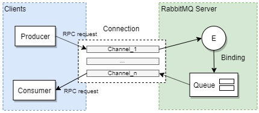

# RabbitMQ

## AMQP
__AMQP__ (___Advanced Message Queuing Protocol___) — открытый протокол для передачи сообщений между компонентами системы. Основная идея состоит в том, что отдельные подсистемы (или независимые приложения) могут обмениваться произвольным образом сообщениями через AMQP-брокер, который осуществляет маршрутизацию, возможно гарантирует доставку, распределение потоков данных, подписку на нужные типы сообщений.

Протокол AMQP вводит три понятия:

* exchange (обменник или точка обмена) — в неё отправляются сообщения. Обменник распределяет сообщение в одну или несколько очередей. Он маршрутизирует сообщения в очередь на основе созданных связей (binding) между ним и очередью
* queue (очередь) — структура данных на диске или в оперативной памяти, которая хранит ссылки на сообщения и отдает копии сообщений consumers (потребителям). Одна очередь может использоваться несколькими потребителями
* binding (привязка) — правило, которое сообщает точке обмена в какую из очередей эти сообщения должны попадать. Обменник и очередь могут быть связаны несколькими привязками

Протокол работает поверх TCP/IP.

__RabbitMQ__ – это брокер сообщений с открытым исходным кодом. Он маршрутизирует собщения по всем базовым принципам протокола AMQP описанным в спецификации. Отправитель передает сообщение брокеру а тот доставляет его получателю. RabbitMQ реализует и дополняет протокол AMQP.

Основная идея модели обмена сообщениями в RabbitMQ заключается в том, что producer (издатель) не отправляет сообщения непосредственно в очередь. На самом деле и довольно часто издатель даже не знает, будет ли сообщение вообще доставлено в какую-либо очередь.

Вместо этого издатель может отправлять сообщения только на обмен. С одной стороны, обмен получает сообщения от издателей, а с другой — отправляет их в очереди. Обмен должен точно знать, что делать с полученным сообщением. Должно ли оно быть добавлено в определенную очередь? Должно ли оно быть добавлено в несколько очередей? Или сообщение нужно игнорировать.

Кратко работу RabbitMQ можно описать следующим образом:

1. Producer отправляет сообщение определенному обменнику
2. Exchange, получив сообщение, маршрутизирует его в одну или несколько очередей в соответствии с правилами привязки между ним и очередью
3. Очередь хранит ссылку на это сообщение. Само сообщение хранится в оперативной памяти или на диске
4. Как только потребитель готов получить сообщение из очереди, сервер создает копию сообщения по ссылке и отправляет
5. Потребитель получает сообщение и отправляет брокеру подтверждение
6. Брокер, получив подтверждение, удаляет копию сообщения из очереди. Затем удаляет из оперативной памяти и с диска

## Подключение и каналы

Для такого обмена информацией между клиентом и сервером используются каналы. Каналы создаются в рамках определенного подключения. Каждый канал изолирован от других каналов. В синхронном случае не возможно выполнять следующую команду, пока не получен ответ.

Для того чтобы иметь возможность отправлять команды параллельно приходится открывать несколько каналов. Каждый канал создает отдельный Erlang процесс. Одно подключение может иметь множество каналов (multiplexing). Для каждого канала существуют некие структуры и объекты в памяти. Поэтому чем больше каналов имеется в рамках соединения, тем больше памяти использует RabbitMQ для управления таким соединением.

Открывать новое соединение для каждой операции, настоятельно не рекомендуется, поскольку это приведет к большим затратам. Каналы также должны быть постоянными, но многие ошибки протокола приводят к закрытию канала, поэтому срок службы канала может быть короче, чем у соединения.

## AMQP 0-9-1

Модель AMQP 0-9-1: сообщения публикуются через exchanges, которые часто сравнивают с почтовыми отделениями или почтовыми ящиками. Затем exchanges распределяют копии сообщений по очередям, используя правила, называемые bindings. Затем брокер либо доставляет сообщения consumer'ам, подписанным на очереди, либо consumer'ы извлекают сообщения из очередей по требованию.

## Где используется?

В контексте микросервисов протокол AMQP и его реализацию в RabbitMQ часто используют для асинхронного взаимодействия между сервисами.

В контексте IIOT протокол AMQP и его реализацию в RabbitMQ используют для обмена данными между серверами (сервер-сервер). Также используют плагин MQTT Plugin RabbitMQ являющегося реализацией протокола MQTT для передачи данных между датчиком и сервером в низкоскоростных средах с высокой задержкой (полный перечень поддерживаемых протоколов перечислен на сайте проекта).

Также можно прочитать \
[Архитектура WhatsApp](https://habr.com/ru/post/276951/)