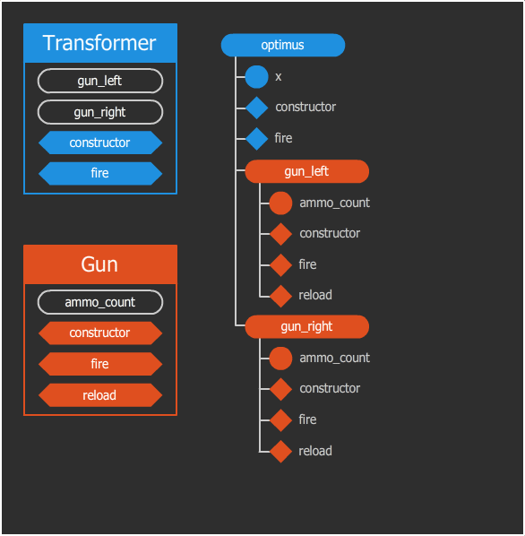
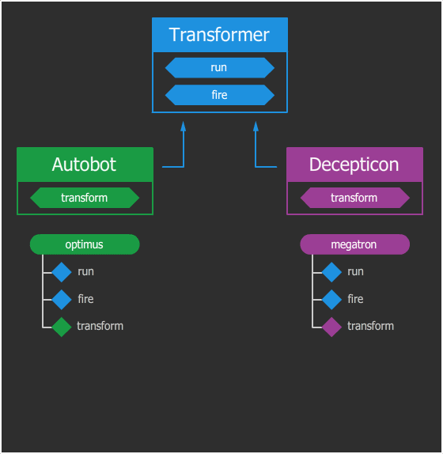
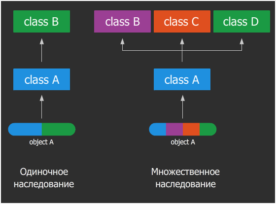
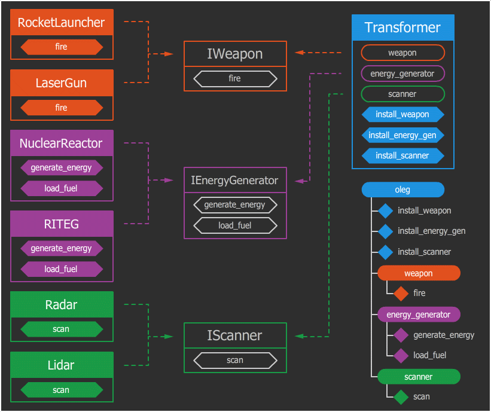

## ООП

ООП (Объектно-Ориентированное Программирование) стало неотъемлемой частью разработки многих современных проектов, но, не смотря на популярность, эта парадигма является далеко не единственной.

Прежде всего стоит ответить, зачем? Объектно-ориентированная идеология разрабатывалась как попытка связать поведение сущности с её данными и спроецировать объекты реального мира и бизнес-процессов в программный код. Задумывалось, что такой код проще читать и понимать человеком, т. к. людям свойственно воспринимать окружающий мир как множество взаимодействующих между собой объектов, поддающихся определенной классификации.

## Классы и объекты

Самое простое объяснение: класс — это чертеж трансформера, а экземпляры этого класса — конкретные трансформеры, например, Оптимус Прайм или Олег. И хотя они и собраны по одному чертежу, умеют одинаково ходить, трансформироваться и стрелять, они оба обладают собственным уникальным состоянием. Состояние — это ряд меняющихся свойств. Поэтому у двух разных объектов одного класса мы можем наблюдать разное имя, возраст, местоположение, уровень заряда, количество боеприпасов и т. д. Само наличие этих свойств и их типы описываются в классе.

Таким образом, класс — это описание того, какими свойствами и поведением будет обладать объект. А объект — это экземпляр с собственным состоянием этих свойств.

Мы говорим «свойства и поведение», но звучит это как-то абстрактно и непонятно. Привычнее для программиста будет звучать так: «переменные и функции». На самом деле «свойства» — это такие же обычные переменные, просто они являются атрибутами какого-то объекта (их называют полями объекта). Аналогично «поведение» — это функции объекта (их называют методами), которые тоже являются атрибутами объекта. Разница между методом объекта и обычной функцией лишь в том, что метод имеет доступ к собственному состоянию через поля.

```python
class Transformer:
    def __init__(self, x: int):
        self.x = x
	
    def run(self):
        self.x += 1


optimus = new Transformer(0)

optimus.run()
print(optimus.x) # 1
optimus.run()
print(optimus.x) # 2
```

## Ассоциация

Традиционно в полях объекта могут храниться не только обычные переменные стандартных типов, но и другие объекты. А эти объекты могут в свою очередь хранить какие-то другие объекты и так далее, образуя дерево (иногда граф) объектов. Это отношение называется ассоциацией.

Предположим, что наш трансформер оборудован пушкой. Хотя нет, лучше двумя пушками. В каждой руке. Пушки одинаковые (принадлежат к одному классу, или, если будет угодно, выполненные по одному чертежу), обе одинаково умеют стрелять и перезаряжаться, но в каждой есть свое хранилище боеприпасов (собственное состояние). Как теперь это описать в ООП? С помощью ассоциации:

```python
class Gun:
    def __init_(self){:
        self.reload()

    def fire(self):
        self.ammo_count -= 1


    def reload(self):
        self.ammo_count = 10


class Transformer: 
    def __init__(self, gun_left: Gun, gun_right: Gun):
        self.gun_left = gun_left
        self.gun_right = gun_right
    
    def fire(self):
        self.gun_left.fire()
        self.gun_right.fire()


gun1 = new Gun()
gun2 = new Gun()
optimus = new Transformer(gun1, gun2)
```



___self.gun_left.fire()___ и ___self.gun_right.fire()___ — это обращения к дочерним объектам, которые происходят так же через точки. По первой точке мы обращаемся к атрибуту себя (self.gun_right), получая объект пушки, а по второй точке обращаемся к методу объекта пушки (self.gun_right.fire()).

Итог: робота сделали, табельное оружие выдали, теперь разберемся, что тут происходит. В данном коде один объект стал составной частью другого объекта. Это и есть ассоциация. Она в свою очередь бывает двух видов:

1. Композиция — случай, когда на фабрике трансформеров, собирая Оптимуса, обе пушки ему намертво приколачивают к рукам гвоздями, и после смерти Оптимуса, пушки умирают вместе с ним. Другими словами, жизненный цикл дочернего объекта совпадает с жизненным циклом родительского.

2. Агрегация — случай, когда пушка выдается как пистолет в руку, и после смерти Оптимуса этот пистолет может подобрать его боевой товарищ Олег, а затем взять в свою руку, либо сдать в ломбард. То бишь жизненный цикл дочернего объекта не зависит от жизненного цикла родительского, и может использоваться другими объектами.

Ортодоксальная ООП-церковь проповедует нам фундаментальную троицу — инкапсуляцию, полиморфизм и наследование, на которых зиждется весь объектно-ориентированный подход. Разберем их по порядку.

## Наследование

Наследование — это механизм системы, который позволяет, как бы парадоксально это не звучало, наследовать одними классами свойства и поведение других классов для дальнейшего расширения или модификации.

Что если, мы не хотим штамповать одинаковых трансформеров, а хотим сделать общий каркас, но с разным обвесом? ООП позволяет нам такую шалость путем разделения логики на сходства и различия с последующим выносом сходств в родительский класс, а различий в классы-потомки. Как это выглядит?

Оптимус Прайм и Мегатрон — оба трансформеры, но один является автоботом, а второй десептиконом. Допустим, что различия между автоботами и десептиконами будут заключаться только в том, что автоботы трансформируются в автомобили, а десептиконы — в авиацию. Все остальные свойства и поведение не будут иметь никакой разницы. В таком случае можно спроектировать систему наследования так: общие черты (бег, стрельба) будут описаны в базовом классе «Трансформер», а различия (трансформация) в двух дочерних классах «Автобот» и «Десептикон».


```python
class Transformer:
    def run():
        # код, отвечающий за бег

    def fire():
        # код, отвечающий за стрельбу


class Autobot(Transformer):
    def transform()
        # код, отвечающий за трансформацию в автомобиль

class Decepticon(Transformer):
    def transform():
        # код, отвечающий за трансформацию в самолет

optimus = Autobot()
megatron = Decepticon()
```



Сей пример наглядно иллюстрирует, как наследование становится одним из способов дедуплицировать код (DRY-принцип) с помощью родительского класса, и одновременно предоставляет возможности для мутации в классах-потомках.

## Перегрузка

Если же в классе-потомке переопределить уже существующий метод в классе-родителе, то сработает перегрузка. Это позволяет не дополнять поведение родительского класса, а модифицировать. В момент вызова метода или обращения к полю объекта, поиск атрибута происходит от потомка к самому корню — родителю. То есть, если у автобота вызвать метод fire(), сначала поиск метода производится в классе-потомке — Autobot, а поскольку его там нет, поиск поднимается на ступень выше — в класс Transformer, где и будет обнаружен и вызван. Следует отметить, что модификация нарушает LSP из набора принципов SOLID, но мы рассматриваем только техническую возможность.

## Неуместное применение

Любопытно, что чрезмерно глубокая иерархия наследования может привести к обратному эффекту — усложнению при попытке разобраться, кто от кого наследуется, и какой метод в каком случае вызывается. К тому же, не все архитектурные требования можно реализовать с помощью наследования. Поэтому применять наследование следует без фанатизма. Существуют рекомендации, призывающие предпочитать композицию наследованию там, где это уместно. Любая критика наследования, которую я встречал, подкрепляется неудачными примерами, когда наследование используется в качестве золотого молотка. Но это совершенно не означает, что наследование в принципе всегда вредит. Мой нарколог говорил, что первый шаг — это признать, что у тебя зависимость от наследования.

Как при описании отношений двух сущностей определить, когда уместно наследование, а когда — композиция? Можно воспользоваться популярной шпаргалкой: спросите себя, сущность А является сущностью Б? Если да, то скорее всего, тут подойдет наследование. Если же сущность А является частью сущности Б, то наш выбор — композиция.

Применительно к нашей ситуации это будет звучать так:

Автобот является Трансформером? Да, значит выбираем наследование.
Пушка является частью Трансформера? Да, значит — композиция.

Для самопроверки попробуйте обратную комбинацию, получится фигня. Эта шпаргалка помогает в большинстве случаев, но бывают и другие факторы, на которые стоит опираться при выборе между композицией и наследованием. Кроме того, эти методы можно комбинировать для решения разного типа задач.

## Наследование статично

Еще одно важное отличие наследования от композиции в том, что наследование имеет статическую природу и устанавливает отношения классов только на этапе интерпретации/компиляции. Композиция же, как мы видели в примерах, позволяет менять отношение сущностей на лету прямо в рантайме — иногда это очень важно, поэтому об этом нужно помнить при выборе отношений (если конечно нет желания использовать метапрограммирование).

## Множественное наследование

Мы рассмотрели ситуацию, когда два класса унаследованы от общего потомка. Но в некоторых языках можно сделать и наоборот — унаследовать один класс от двух и более родителей, объединив их свойства и поведение. Возможность наследоваться от нескольких классов вместо одного — это множественное наследование.



## Абстрактные классы

Кроме обычных классов в некоторых языках существуют абстрактные классы. От обычных классов они отличаются тем, что нельзя создать объект такого класса. Зачем же нужен такой класс, спросит читатель? Он нужен для того, чтобы от него могли наследоваться потомки — обычные классы, объекты которых уже можно создавать.

Абстрактный класс наряду с обычными методами содержит в себе абстрактные методы без имплементации (с сигнатурой, но без кода), которые обязан имплементировать программист, задумавший создать класс-потомок. Абстрактные классы не обязательны, но они помогают установить контракт, обязующий имплементировать определенный набор методов, дабы уберечь программиста с плохой памятью от ошибки имплементации.

## Полиморфизм

Полиморфизм — свойство системы, позволяющее иметь множество реализаций одного интерфейса. Ничего непонятно. Обратимся к трансформерам.

Положим, у нас есть три трансформера: Оптимус, Мегатрон и Олег. Трансформеры боевые, стало быть обладают методом attack(). Игрок, нажимая у себя на джойстике кнопку «воевать», сообщает игре, чтобы та вызвала метод attack() у трансформера, за которого играет игрок. Но поскольку трансформеры разные, а игра интересная, каждый из них будет атаковать каким-то своим способом. Скажем, Оптимус — объект класса Автобот, а Автоботы снабжаются пушками с плутониевыми боеголовками (да не прогневаются фанаты трансформеров). Мегатрон — Десептикон, и стреляет из плазменной пушки. Олег — басист, и он обзывается. А в чем польза?

Польза полиморфизма в данном примере заключается в том, что код игры ничего не знает о реализации его просьбы, кто как должен атаковать, его задача просто вызвать метод attack(), сигнатура которого одинакова для всех классов персонажей. Это позволяет добавлять новые классы персонажей, или менять методы существующих, не меняя код игры. Это удобно.

## Инкапсуляция

Инкапсуляция — это заключение данных и функционала в оболочку. В объектно-ориентированном программировании в роли оболочки выступают классы: они не только собирают переменные и методы в одном месте, но и защищают их от вмешательства извне (сокрытие).

Важно! Инкапсуляция не является сокрытием. Сокрытие — это часть инкапсуляции.

Во многих языках частью инкапсуляции является сокрытие данных. Для этого существуют модификаторы доступа (опишем те, которые есть почти во всех ООП языках):

publiс — к атрибуту может получить доступ любой желающий
private — к атрибуту могут обращаться только методы данного класса
protected — то же, что и private, только доступ получают и наследники класса в том числе

Как правильно выбрать модификатор доступа? В простейшем случае так: если метод должен быть доступен внешнему коду, выбираем public. В противном случае — private. Если есть наследование, то может потребоваться protected в случае, когда метод не должен вызываться снаружи, но должен вызываться потомками.

## Аксессоры (геттеры и сеттеры)

Геттеры и сеттеры — это методы, задача которых контролировать доступ к полям. Геттер считывает и возвращают значение поля, а сеттер — наоборот, принимает в качестве аргумента значение и записывает в поле. Это дает возможность снабдить такие методы дополнительными обработками. Например, сеттер при записи значения в поле объекта, может проверить тип, или входит ли значение в диапазон допустимых (валидация). В геттер же можно добавить, ленивую инициализацию или кэширование, если актуальное значение на самом деле лежит в базе данных. Применений можно придумать множество.

В некоторых языках есть синтаксический сахар, позволяющий такие аксессоры маскировать под свойства, что делает доступ прозрачным для внешнего кода, который и не подозревает, что работает не с полем, а с методом, у которого под капотом выполняется SQL-запрос или чтение из файла. Так достигается абстракция и прозрачность.

## Интерфейсы

Задача интерфейса — снизить уровень зависимости сущностей друг от друга, добавив больше абстракции.

Не во всех языках присутствует этот механизм, но в ООП языках со статической типизацией без них было бы совсем худо. Выше мы рассматривали абстрактные классы, затрагивая тему контрактов, обязующих имплементировать какие-то абстрактные методы. Так вот интерфейс очень смахивает на абстрактный класс, но является не классом, а просто пустышкой с перечислением абстрактных методов (без имплементации). Другими словами, интерфейс имеет декларативную природу, то есть, чистый контракт без капельки кода.

Обычно в языках, в которых есть интерфейсы, нет множественного наследования классов, но есть множественное наследование интерфейсов. Это позволяет классу перечислить интерфейсы, которые он обязуется имплементировать.

Классы с интерфейсами состоят в отношении «многие ко многим»: один класс может имплементировать множество интерфейсов, и каждый интерфейс, в свою очередь, может имплементироваться многими классами.

У интерфейса двустороннее применение:

По одну сторону интерфейса — классы, имплементирующие данный интерфейс.
По другую сторону — потребители, которые используют этот интерфейс в качестве описания типа данных, с которым они (потребители) работают.

Например, если какой-то объект помимо основного поведения, может быть сериализован, то пускай он имплементирует интерфейс «Сериализуемый». А если объект можно склонировать, то пусть он имплементирует еще один интерфейс — «Клонируемый». И если у нас есть какой-то транспортный модуль, который передает объекты по сети, он будет принимать любые объекты, имплементирующие интерфейс «Сериализуемый».

Представим, что каркас трансформера оборудован тремя слотами: слот для оружия, для генератора энергии и для какого-нибудь сканера. Эти слоты обладают определенными интерфейсами: в каждый слот можно установить только подходящее оборудование. В слот для оружия можно установить ракетную установку или лазерную пушку, в слот для генератора энергии — ядерный реактор или РИТЭГ (радиоизотопный термоэлектрический генератор), а в слот для сканера — радар или лидар. Суть в том, что каждый слот имеет универсальный интерфейс подключения, а уже конкретные устройства должны соответствовать этому интерфейсу. К примеру, на материнских платах используется несколько типов слотов: слот для процессора позволяет подключать различные процессоры, подходящие под данный сокет, а слот SATA — любой SSD или HDD накопитель или даже CD/DVD.

Обращаю внимание, что получившаяся система слотов у трансформеров — это пример использования композиции. Если же оборудование в слотах будет сменным в ходе жизни трансформера, то тогда это уже агрегация. Для наглядности, мы будем называть интерфейсы, как принято в некоторых языках, добавляя заглавную «И» перед именем: IWeapon, IEnergyGenerator, IScanner.


```python
from abc import ABC, abstractmethod


class IWeapon(ABC):
    @abstractmethod
    def fire(): ...


class IEnergyGenerator(ABC):
    @abstractmethod
    def generate_energy(): ...

    @abstractmethod
    def load_fuel(): ...


class IScanne(ABC):
    @abstractmethod
    def scan(): ...

class RocketLauncher(IWeapon):
    def fire():
        # имплементация запуска ракеты


class LaserGun(IWeapon): 
    def fire():
        # имплементация выстрела лазером


class NuclearReactor(IEnergyGenerator): 

    def generate_energy():
        # имплементация генерации энергии ядерным реактором
	
    def load_fuel()
        # имплементация загрузки урановых стержней


class RITEG(IEnergyGenerator): 
    def generate_energy():
        # имплементация генерации энергии РИТЭГ
	
    def load_fuel():
        # имплементация загрузки РИТЭГ-пеллет


class Radar(IScanner): 
    def scan():
        # имплементация использования радиолокации

class Lidar(IScanner): 
    def scan():
        // имплементация использования оптической локации
    

class Transformer():
    def install_weapon(IWeapon weapon):
        self.slot_weapon = weapon

    def install_energy_generator(energy_generator: IEnergyGenerator):
        self.slot_energy_generator = energy_generator

    def install_scanner(scanner: IScanner):
        self.slot_scanner = scanner


class TransformerFactory():
    def build_some_transformer():
       	transformer = Transformer()
       	laser_gun = LaserGun()
       	nuclear_reactor = NuclearReactor()
       	radar = Radar()
       	
       	transformer.install_weapon(laser_gun)
       	transformer.install_energy_generator(nuclear_reactor)
       	transformer.install_scanner(radar)
        	
        return transformer

transformer_factory = TransformerFactory()
oleg = transformer_factory.build_some_transformer()
```




К сожалению, в картинку не влезла фабрика, но она все равно необязательна, трансформера можно собрать и во дворе.

Обозначенный на картинке слой абстракции в виде интерфейсов между слоем имплементации и слоем-потребителем дает возможность абстрагировать одних от других. Вы можете это наблюдать, посмотрев на каждый слой в отдельности: в слое имплементации (слева) нет ни слова про класс Transformer, а в слое-потребителе (справа) нет ни слова про конкретные имплементации (там нет слов Radar, RocketLauncher, NuclearReactor и т. д.)

В таком коде мы можем создавать новые комплектующие к трансформерам, не затрагивая чертежи самих трансформеров. В то же время и наоборот, мы можем создавать новых трансформеров, комбинируя уже существующие комплектующие, либо добавлять новые комплектующие, не меняя существующих.

## Абстракция

В ООП все крутится вокруг абстракции. Существуют фанатики, утверждающие, что абстракция должна быть частью ООП-троицы (инкапсуляция, полиморфизм, наследование). А мой инспектор по УДО говорил обратное: абстракция присуща для любого программирования, а не только для ООП, поэтому она должна стоять отдельно. С другой стороны, то же самое можно сказать и про остальные принципы, но из песни слов не выкинешь. Так или иначе, абстракция нужна, и особенно в ООП.

## Уровень абстракции

Тут нельзя не процитировать одну известную шутку:
— любую архитектурную проблему можно решить добавлением дополнительного слоя абстракции, кроме проблемы большого количества абстракций.

В нашем примере с интерфейсами мы внедрили слой абстракции между трансформерами и комплектующими, сделав архитектуру более гибкой. Но какой ценой? Нам пришлось усложнить архитектуру. Мой психотерапевт говорил, что умение балансировать между простотой архитектуры и гибкостью приложения — это искусство. Выбирая золотую середину, следует опираться не только на собственный опыт и интуицию, но и на контекст текущего проекта. Поскольку будущее человек видеть пока не научился, нужно аналитически прикинуть, какой уровень абстракции и с какой долей вероятности может пригодиться в данном проекте, сколько времени потребуется на проработку гибкой архитектуры, и окупится ли затраченное время в будущем.

Неверный выбор уровня абстракции ведет к одной из двух проблем:

если абстракции недостаточно, дальнейшие расширения проекта будут упираться в архитектурные ограничения, которые ведут либо к рефакторингу и смене архитектуры, либо к обилию костылей (оба варианта обычно несут за собой боль и финансовые потери)
если уровень абстракции слишком высок, это приведет к оверинжинирингу в виде чересчур сложной архитектуры, которую трудно поддерживать, и излишней гибкости, которая никогда в этом проекте не пригодится. В этой ситуации любые простейшие изменения в проекте будут сопровождаться дополнительной работой для удовлетворения требований архитектуры (это тоже порой несет определенную боль и финансовые потери)


Еще важно понимать, что уровень абстракции определяется не для всего проекта в целом, а отдельно для разных компонентов. В каких-то местах системы абстракции может быть недостаточно, а где-то наоборот — перебор. Однако, неверный выбор уровня абстракции можно исправить своевременным рефакторингом. Ключевое слово — своевременным. Запоздалый рефакторинг провести проблематично, когда на данном уровне абстракции реализовано уже множество механизмов. Проводить обряд рефакторинга в запущенных системах может сопрягаться с острой болью в труднодоступных местах программиста. Это примерно как поменять фундамент в доме — дешевле построить рядом дом с нуля.

Давайте рассмотрим определение уровня абстракции из возможных вариантов на примере гипотетической игры «трансформеры-онлайн». Уровни абстракции в данном случае будут выступать как слои, каждый последующий рассматриваемый слой будет ложиться поверх предыдущего, забирая из него часть функционала в себя.

___Первый слой.___ В игре есть один класс трансформера, все свойства и поведение описаны в нем. Это совсем деревянный уровень абстракции, подходит для казуальной игры, которая не предполагает никакой особой гибкости.

___Второй уровень.___ В игре есть базовый трансформер с основными способностями и классы трансформеров со своей специализацией (типа разведчик, штурмовик, саппорт), которая описывается дополнительными методами. Тем самым игроку предоставляется возможность выбора, а разработчикам упрощается добавление новых классов.

___Третий уровень.___ Помимо классификации трансформеров вводится агрегация с помощью системы слотов и компонентов (как в нашем примере с реакторами, пушками и радарами). Теперь часть поведения будет определяться тем, какой стаф игрок установил в своего трансформера. Это дает игроку еще больше возможностей для кастомизации игровой механики персонажа, а разработчикам дает возможность добавлять эти самые модули расширения, что в свою очередь упрощает работу гейм-дизайнерам по выпуску нового контента.

___Четвертый уровень.___ В компоненты можно тоже включить собственную агрегацию, предоставляющую возможность выбора материалов и деталей, из которого собираются эти компоненты. Такой подход даст игроку возможность не только набивать трансформеров нужными комплектующими, но и самостоятельно производить эти комплектующие из различных деталек. Признаться, такой уровень абстракции я в играх никогда не встречал, и не без резона! Ведь это сопровождается значительным усложнением архитектуры, а регулировка баланса в таких играх превращается в ад. Но не исключаю, что такие игры существуют.


Как видим, каждый описанный слой, в принципе, имеет право на жизнь. Все зависит от того, какую именно гибкость мы хотим заложить в проект. Если в техническом задании ничего об этом не сказано, или автор проекта сам не знает, что может потребовать бизнес, можно посмотреть на похожие проекты в этой сфере и ориентироваться на них.
