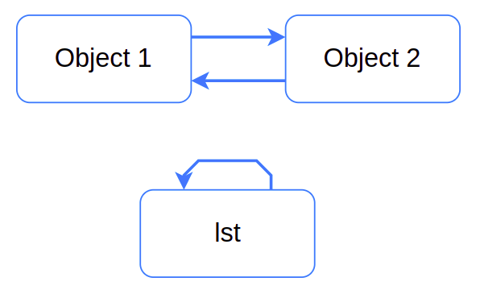

### Содержание
+ [Введение](#введение)
+ [Диспетчер памяти](#диспетчер-памяти)
+ [Организация доступной виртуальной памяти](#организация-доступной-виртуальной-памяти)
+ [Освобождение памяти: счетчик ссылок](#освобождение-памяти-счетчик-ссылок)
+ [Дополнительный сборщик мусора](#дополнительный-сборщик-мусора)
+ [Когда GC срабатывает](#когда-gc-срабатывает)
+ [Советы по оптимизации](#советы-по-оптимизации)
+ [Как найти и отладить циклические ссылки](#как-найти-и-отладить-циклические-ссылки)
+ [Заключение](#заключение)

#### *[Источник №1](https://proglib.io/p/pomnit-vse-kak-rabotaet-pamyat-v-python-2021-03-14)*
#### *[Источник №2](https://habr.com/ru/post/417215/)*

### Введение
Python многое делает за нас. Мы привыкли не заботиться об управлении памятью и о написании соответствующего кода. Пусть эти процессы и скрыты, но без их понимания трудно подготовить производительный код для высоконагруженных задач. В этой статье мы рассмотрим модель памяти Python и то, как интерпретатор Python взаимодействует с оперативной памятью компьютера.

### Диспетчер памяти[^](#содержание)
CPython не взаимодействует напрямую с регистрами и ячейками физической памяти — только с ее виртуальным представлением. В начале выполнения программы операционная система создает новый процесс и выделяет под него ресурсы. Выделенную виртуальную память интерпретатор использует для 1) собственной корректной работы, 2) стека вызываемых функций и их аргументов и 3) хранилища данных, представленного в виде кучи.

В отличие от C/C++, мы не можем управлять состоянием кучи напрямую из Python. Функции низкоуровневой работы с памятью предоставляются Python/C API, но обычно интерпретатор просто обращается к хранилищу данных через диспетчер памяти Python (memory manager).

Диспетчер памяти — своеобразный портье, который регистрирует и расселяет гостей отеля. Каждый постоялец получает ключ с номером комнаты, так что ни один из гостей не может заселиться не в свой номер. Две программы не могут одновременно записать переменную в одно место виртуальной памяти.

Фактически за это отвечает даже не диспетчер задач, который ожидает гостей за регистрационной стойкой, а GIL — глобальная блокировка интерпретатора. GIL гарантирует: в один и тот же момент времени байт-код выполняется только одним потоком. Главное преимущество — безопасная работа с памятью, а основной недостаток в том, что многопоточное выполнение программ Python требует специфических решений.

Очевидно, программа не сама выполняет сохранение и освобождение памяти — ведь мы не пишем соответствующих инструкций. Интерпретатор лишь запрашивает диспетчер памяти сделать это. А диспетчер уже делегирует работу, связанную с хранением данных, аллокаторам — распределителям памяти.

### Организация доступной виртуальной памяти[^](#содержание)
Непосредственно с оперативной памятью взаимодействует распределитель сырой памяти (raw memory allocator). Поверх него работают аллокаторы, реализующие стратегии управления памятью, специфичные для отдельных типов объектов. Объекты разных типов — например, числа и строки — занимают разный объем, к ним применяются разные механизмы хранения и освобождения памяти. Аллокаторы стараются не занимать лишнюю память до тех пор, пока она не станет совершенно необходимой — этот момент определен стратегией распределения памяти CPython.

Python использует динамическую стратегию, то есть распределение памяти выполняется во время выполнения программы. Виртуальная память Python представляет иерархическую структуру, оптимизированную под объекты Python размером менее 256 Кб:

+ **Арена** — фрагмент памяти, расположенный в пределах непрерывного блока оперативной памяти объемом 256 Кб. Объекты размером более 256 Кб направляются в стандартный аллокатор C.
+ **Пул** — блок памяти внутри арены, занимающий 4 Кб, что соответствует одной странице виртуальной памяти. То есть одна арена включает до 256/4 = 64 пулов.
+ **Блок** — элемент пула размером от 16 до 512 байт. В пределах пула все блоки имеют одинаковый размер. Размер блока определяется тем, сколько байт требуется для представления конкретного объекта. Размеры блоков кратны 16 байт. То есть существует всего 512/16 = 32 классов (size class) блоков. То есть в одном пуле, в зависимости от класса, может находиться от 8 до 256 блоков.


#### Блок
Блок содержит не более одного объекта Python и находится в одном из трех состояний:

+ `untouched` — блок еще не использовался для хранения данных;
+ `free` — блок использовался механизмом памяти, но больше не содержит используемых программой данных;
+ `allocated` — блок хранит данные, необходимые для выполнения программы.
В пределах пула блоки `free` организованы в односвязный список с указателем `freeblock`. Если аллокатору для выделения памяти не хватит блоков списка `freeblock`, он задействует блоки `untouched`. Освобождение памяти означает всего лишь то, что аллокатор меняет статус блока с `allocated` на free и начинает отслеживать блок в списке `freeblock`.

#### Пул
Пул может находиться в одном из трех состояний: `used` (занят), `full` (заполнен), `empty`(пуст). Пустые пулы отличаются от занятых отсутствием блоков `allocated` и тем, что для них пока не определен `size class`. Пулы `full` полностью заполнены блоками `allocated` и недоступны для записи. Стоит освободиться любому из блоков заполненного пула — и он помечается как `used`.

Пулы одного типа и одного размера блоков организованы в двусвязные списки. Это позволяет алгоритму легко находить доступное пространство для блока заданного размера. Алгоритм проверяет список `usedpools` и размещает блок в доступном пуле. Если в `usedpools` нет ни одного подходящего пула для запроса, алгоритм использует пул из списка `freepools`, который отслеживает пулы в состоянии `empty`.

#### Арена
Арены содержат пулы любых видов и организованы в двусвязный список `usable_arenas`. Список отсортирован по количеству доступных пустых пулов. Чем меньше в арене таких пулов, тем она ближе к началу списка. Для размещения новых данных выбирается область, наиболее заполненная данными.

Информацию о текущем распределении памяти в аренах, пулах и блоках можно посмотреть, запустив функцию `sys._debugmallocstats()`:
```pycon
>>> import sys
>>> sys._debugmallocstats()
Small block threshold = 512, in 32 size classes.
class   size   num pools   blocks in use  avail blocks
-----   ----   ---------   -------------  ------------
    0     16           1             212            41
    1     32           6             629           127
    2     48          28            2317            35
    3     64         118            7386            48
    4     80         104            5164            36
    5     96          17             696            18
    6    112          11             372            24
    7    128           7             212             5
    8    144          37            1014            22
    9    160           7             174             1
   10    176          64            1426            46
   11    192           4              66            18
   12    208           3              42            15
   13    224          11             181            17
   14    240           5              65            15
   15    256           3              35            10
   16    272           2              23             5
   17    288           3              28            14
   18    304          15             184            11
   19    320           2              17             7
   20    336           2              14            10
   21    352           2              13             9
   22    368           2              15             7
   23    384           1               9             1
   24    400           3              23             7
   25    416           4              31             5
   26    432           6              42            12
   27    448           4              28             8
   28    464           4              26             6
   29    480           4              27             5
   30    496           5              33             7
   31    512           6              37             5

# arenas allocated total           =                   10
# arenas reclaimed                 =                    2
# arenas highwater mark            =                    8
# arenas allocated current         =                    8
8 arenas * 262144 bytes/arena      =            2,097,152
```
Чтобы не произошло утечки памяти, диспетчер памяти должен отследить, что вся выделенная память освободится после завершения работы программы. То есть при завершении программы CPython дает задание очистить все арены.

Именно количество используемых арен определяет объем оперативной памяти, занимаемой программой на Python — если в арене все пулы в состоянии empty, СPython делает запрос на освобождение этого участка виртуальной памяти. Но уже понятно: чтобы пулы стали `empty`, все их блоки должны быть `free` или `untouched`. Получается, нужно понять, как CPython освобождает память.

### Освобождение памяти: счетчик ссылок[^](#содержание)
Для освобождения памяти используются два механизма: счетчик ссылок и сборщик мусора.

Всё в Python является объектами, а прародителем всех типов объектов в реализации CPython является PyObject. От него наследуются все остальные типы. В PyObject определены счетчик ссылок и указатель на фактический тип объекта. Счетчик ссылок увеличивается на единицу, когда мы создаем что-то, что обращается к объекту, например, сохраняем объект в новой переменной. И наоборот, счетчик уменьшается на единицу, когда мы перестаем ссылаться на объект.

Счетчик ссылок любого объекта можно проверить с помощью `sys.getrefcount()`. Учтите, что передача объекта в `getrefcount()` увеличивает счетчик ссылок на 1, так как сам вызов метода создает еще одну ссылку. Когда счетчик уменьшается до нуля, происходит вызов аллокатора для освобождения соответствующих блоков памяти.
```pycon
>>> import sys
>>> a = {}
>>> b = a
>>> sys.getrefcount(a)
3
>>> del b
>>> sys.getrefcount(a)
2
```

### Дополнительный сборщик мусора[^](#содержание)

Зачем нам нужен дополнительный алгоритм, когда у нас уже есть подсчет ссылок?

К сожалению, классический алгоритм подсчета ссылок имеет один большой недостаток — он не умеет находить циклические ссылки. Циклические ссылки происходят когда один или более объектов ссылаются на друг друга.




Как вы можете видеть, объект lst ссылается сам на себя, тогда как object1 и object2 ссылаются друг на друга. Для таких объектов счетчик ссылок всегда будет равен 1.

Демонстрация на Python:
```python
import gc

# используется ctypes для доступа к объектам по адресу памяти
class PyObject(ctypes.Structure):
    _fields_ = [("refcnt", ctypes.c_long)]


gc.disable()  # выключаем циклический GC

lst = []
lst.append(lst)

# сохраняем адрес списка lst
lst_address = id(lst)

# удаляем ссылку lst
del lst

object_1 = {}
object_2 = {}
object_1['obj2'] = object_2
object_2['obj1'] = object_1

obj_address = id(object_1)

# удаляем ссылки
del object_1, object_2

# раскомментируйте для запуска ручной сборки объектов с циклическими ссылками
# gc.collect()

# проверяем счетчик ссылок
print(PyObject.from_address(obj_address).refcnt)
print(PyObject.from_address(lst_address).refcnt)
```
В примере выше, инструкция `del` удаляет ссылки на наши объекты (не сами объекты). Как только Python выполняет инструкцию `del` эти объекты становятся недоступны из Python кода. Однако, с выключенным модулем gc они по прежнему будут оставаться в памяти, т.к. они имели циклические ссылки и их счетчик по прежнему равен единице. Вы можете визуально исследовать такие связи используя библиотеку `objgraph`.

Для того, чтобы исправить эту проблему, в Python 1.5 был добавлен дополнительный алгоритм, известный как модуль `gc`. Единственная задача которого удаление циклических объектов, к которым уже нет доступа из кода.

Циклические ссылки могут происходить только в “контейнерных” объектах. Т.е. в объектах, которые могут хранить другие объекты, например в списках, словарях, классах и кортежах. GC не следит за простыми и неизменяемыми типами, за исключением кортежей. Некоторые кортежи и словари так же исключаются из списка слежки при выполнении определенных условий. Со всеми остальными объектами гарантированно справляется алгоритм подсчета ссылок.

### Когда GC срабатывает[^](#содержание)
В отличие от алгоритма подсчета ссылок, циклический GC не работает в режиме реального времени и запускается периодически. Каждый запуск сборщика создаёт микропаузы в работе кода, поэтому CPython (стандартный интерпретатор) использует различные эвристики, для определения частоты запуска сборщика мусора.

Циклический сборщик мусора разделяет все объекты на 3 поколения (генерации). Новые объекты попадают в первое поколение. Если новый объект выживает процесс сборки мусора, то он перемещается в следующее поколение. Чем выше поколение, тем реже оно сканируется на мусор. Так-как новые объекты зачастую имеют очень маленький срок жизни (являются временными), то имеет смысл опрашивать их чаще, чем те, которые уже прошли через несколько этапов сборки мусора.

В каждой генерации есть специальный счетчик и порог срабатывания, при достижении которых срабатывает процесс сборки мусора. Каждый счетчик хранит количество аллокаций минус количество деаллокаций в данной генерации. Как только в Python создается какой либо контейнерный объект, он проверяет эти счетчики. Если условия срабатывают, то начинается процесс сборки мусора.

Если сразу несколько или больше поколений преодолели порог, то выбирается наиболее старшее поколение. Это сделано из-за того, что старые поколения также сканируют все предыдущие. Чтобы сократить число пауз сборки мусора для долгоживущих объектов, самая старшая генерация имеет дополнительный набор условий.

Стандартные пороги срабатывания для поколений установлены на 700, 10 и 10 соответственно, но вы всегда можете их изменить с помощью функций `gc.get_threshold` и `gc.set_threshold`.

GC итерирует каждый объект из выбранных поколений и временно удаляет все ссылки от отдельно взятого объекта (все ссылки на которые этот объект ссылается). После полного прохода, все объекты, у которых счетчик ссылок меньше двух считаются недоступными из питона и могут быть удалены.

### Советы по оптимизации[^](#содержание)

Циклы зачастую случаются в реальных задачах, их можно встретить в задачах с графами, связными списками или в структурах данных, где требуется вести учёт отношений между объектами. Если ваша программа имеет высокую нагрузку и требовательна к задержкам, то, по возможности, циклы лучше избегать.

В местах, где вы заведомо используйте циклические ссылки, можно использовать «слабые» ссылки. Слабые ссылке реализованы в модуле weakref и в отличие от обычных ссылок никак не влияют на счётчик ссылок. Если объект со слабой ссылок оказывается удалённым, то вместо него возвращается None.

В некоторых случаях полезно отключить автоматическую сборку модулем `gc` и вызывать его вручную. Для этого достаточно вызывать `gc.disable()` и в дальнейшем вызывать `gc.collect()` вручную.

### Как найти и отладить циклические ссылки[^](#содержание)

Отладка циклов может быть мучительной, особенно если в вашем коде используется множество сторонних модулей.

Модуль `gc` предоставляет вспомогательные функции, которые могут помочь в отладке. Если параметры GC установить на флаг `DEBUG_SAVEALL`, то все недоступные объекты будут добавлены в список `gc.garbage`.
```python
import gc

gc.set_debug(gc.DEBUG_SAVEALL)

print(gc.get_count())
lst = []
lst.append(lst)
list_id = id(lst)
del lst
gc.collect()
for item in gc.garbage:
    print(item)
    assert list_id == id(item)
```
Как только вы определите проблемное место — его можно визуализировать с помощью `objgraph`.


### Заключение[^](#содержание)
Сохранение и освобождение блоков памяти требует времени и вычислительных ресурсов. Чем меньше блоков задействовано, тем выше скорость работы программы. Позволим себе дать несколько советов, касающихся экономной работы с памятью:

+ Обращайте внимание на работу с неизменяемыми объектами. К примеру, вместо использования оператора + для соединения строк используйте методы `.join()`, `.format()` или f-строки.
+ Избегайте вложенных циклов. Создание сложных вложенных циклов приводит к генерации чрезмерно большого количества объектов, занимающих значительную часть виртуальной памяти. Большинство задач, решаемых с помощью вложенных циклов, разрешимы методами модуля itertools.
+ Используйте кэширование. Если вы знаете, что функция или класс используют или генерируют набор однотипных объектов, применяйте кэширование. Часто для этого достаточно добавить всего лишь один декоратор из библиотеки functools.
+ Профилируйте код. Если программа начинает «тормозить», то профилирование — самый быстрый способ найти корень всех зол.