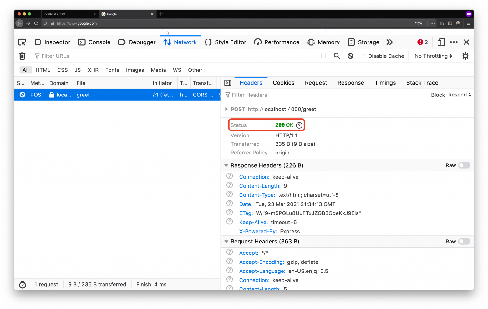
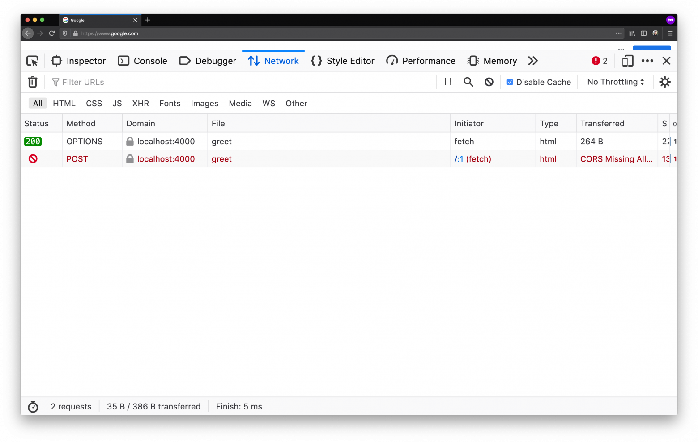
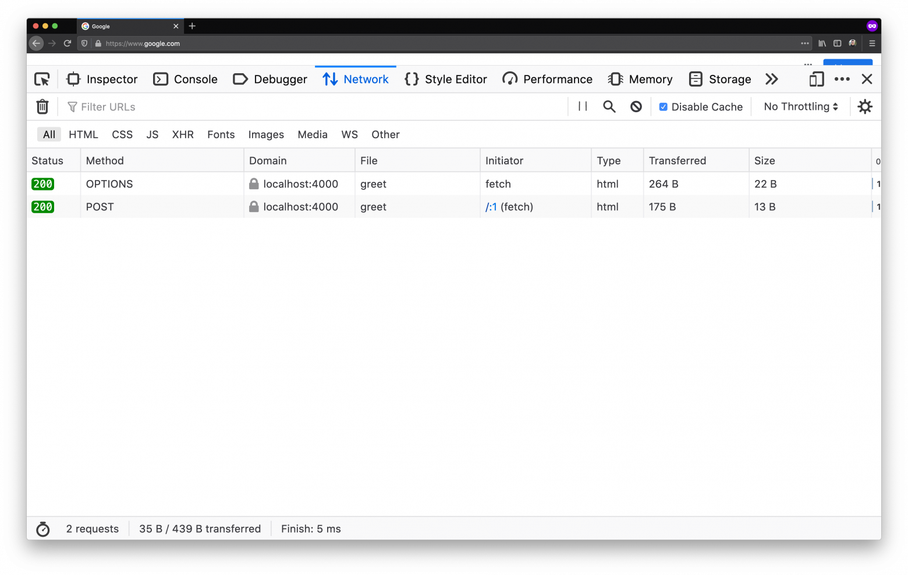

### Содержание
- [Содержание](#содержание)
- [Ошибка в консоли вашего браузера](#ошибка-в-консоли-вашего-браузера)
- [В начале был первый субресурс](#в-начале-был-первый-субресурс)
- [Источники & cross-origin](#источники-и-cross-origin)
- [Слишком много опасностей запроса между различными источниками](#слишком-много-опасностей-запроса-между-различными-источниками)
- [Политика одинакового источника](#политика-одинакового-источника)
- [Врываемся в CORS](#врываемся-в-cors)
- [Запись из разных источников](#запись-из-разных-источников)
- [Предварительные запросы](#предварительные-запросы)
- [Считывание из разных источников](#считывание-из-разных-источников)
- [Тонкая настройка CORS](#тонкая-настройка-cors)
- [Несколько правильных решений](#несколько-правильных-решений)
- [Свободный доступ для всех](#свободный-доступ-для-всех)
- [Всё в семью](#всё-в-семью)
- [Null источник](#null-источник)
- [Пропускай куки, если возможно](#пропускай-куки-если-возможно)
- [Примеры управления корсами в питонячьих фреймворках](#примеры-управления-корсами-в-питонячьих-фреймворках)

*[Источник](https://habr.com/ru/company/macloud/blog/553826/)*

### Ошибка в консоли вашего браузера

No ‘Access-Control-Allow-Origin’ header is present on the requested resource.

Cross-Origin Request Blocked: The Same Origin Policy disallows reading the remote resource at https://example.com/

Access to fetch at ‘https://example.com’ from origin ‘http://localhost:3000’ has been blocked by CORS policy.

Я уверен, вам уже доводилось видеть похожие сообщения об ошибках в консоли вашего браузера. Если нет, не волнуйтесь, скоро увидите. 
Все программисты достаточно часто натыкаются на CORS-ошибки. 

Эти всплывающие ошибки в процессе разработки просто раздражают. Но на самом деле, CORS — это невероятно полезный механизм в мире неправильно настроенных веб серверов, злоумышленников, орудующих в интернете и организаций, продвигающих веб-стандарты.

Но давайте-ка пойдем к истокам…

### В начале был первый субресурс 

Субресурс  — это HTML элемент, который требуется вставить в документ или выполнить  в контексте этого документа. В 1993 году был введен первый тег \. С появлением веб стал более красивым, но заодно и стал сложнее.


Как вы поняли, если ваш браузер отображает страницу с \, он должен запросить этот тег из источника. Если браузер запрашивает тег из источника, который отличается от получателя по схеме, в полностью определенному имени хоста или порту, то это и есть запрос между различными источниками (cross-origin request).

### Источники и cross-origin

Источник идентифицируется следующей тройкой параметров: схема, полностью определенное имя хоста и порт. Например, <http://example.com> и <https://example.com> имеют разные источники: первый использует схему http, а второй https. Вдобавок, портом для http по умолчанию является 80, тогда как для https — 443. Следовательно, в данном примере 2 источника отличаются схемой и портом, тогда как хост один и тот же (example.com).

Таким образом, если хотя бы один из трех элементов у двух ресурсов отличается, то источник ресурсов также считается разным.

Если, к примеру, мы будем сравнивать источник <https://blog.example.com/posts/foo.html> с другими источниками, то мы получим следующие результаты:

|URL	                                        |Результат    |Причина
|:-------------------------------------------:|:-----------:|:-------------------------------------------------------:|
|https://blog.example.com/posts/bar.html      |Тот же	      |Отличается только путь|
|https://blog.example.com/contact.html        |Тот же 	    |Отличается только путь|
|http://blog.example.com/posts/bar.html       |Отличен	    |Разные протоколы|
|https://blog.example.com:8080/posts/bar.html |Отличен	    |Отличается порт (https:// порт является по умолчанию 443)|
|https://example.com/posts/bar.html           |Отличен	    |Разный хост|

Пример запроса между различными источниками: когда ресурс (то есть, страница) типа <http://example.com/posts/bar.html> попробует отобразить тег из источника <https://example.com> (заметьте, что схема поменялась!).

### Слишком много опасностей запроса между различными источниками

Теперь, когда мы определились, что такое совместное использования ресурсов между разными и одинаковыми источниками, давайте посмотрим, в чем же дело. 

Когда тег \ появился во Всемирной Паутине, мы тем самым открыли ящик Пандоры. Некоторое время спустя в Сети появились теги \<script>\, \<frame>\, \<video>\, \<audio>\, \<iframe>\, \<link>\, \<form> и так далее. Эти теги могут быть загружены браузером уже после загрузки страницы, поэтому они все могут быть запросами в пределах одного источника и между о разными источниками. 

Давайте погрузимся в воображаемый мир, где не существует CORS и веб-браузеры допускают все типы запросов между источниками. 

Предположим, у меня есть страница на сайте evil.com с \<script>. На первый взгляд это обычная страница, где можно прочесть полезную информацию. Но я специально создал код в теге \<script>, 
который будет отправлять специально созданный запрос по удалению аккаунта (DELETE/account) на сайт банка. Как только вы загрузили страницу, JavaScript запускается и AJAX-запрос попадает в  API банка. 


Вжух, нет вашего аккаунта

Немыслимо, да? Представьте, что вы читаете что-то на веб странице и вам приходит электронное письмо от банка, что ваш аккаунт успешно удален. Знаю, знаю… если бы было так просто провести любую банковскую операцию… Отвлекся.

Для того чтобы мой вредоносный \<script> сработал, ваш браузер должен был также отправить ваши учетные данные (куки), взятые с банковского сайта, как часть запроса. Именно таким образом банковские серверы идентифицировали бы вас и знали, какой аккаунт нужно удалить.

Давайте рассмотрим другой, не такой зловещий сценарий.

Мне нужно опознать людей, которые работают на Awesome Corp, внутренний сайт этой компании  находится по адресу intra.awesome-corp.com. На моем сайте, dangerous.com, у меня есть .

У пользователей, у которых нет активного сеанса с intra.awesome-corp.com, аватарка не отобразится, так как это приведет к ошибке. Однако если вы совершили вход во внутреннюю сеть Awesome Corp., как только вы откроете мой dangerous.com сайт, я буду знать, что у вас там есть аккаунт. 

Это означает, что я смогу прощупать  определенную информацию о вас. Конечно, для меня будет сложнее устроить атаку, но знание о том, что у вас есть доступ к Awesome Corp., является потенциальным направлением  для атаки.


Утечка информации к 3-им лицам

Эти два примера крайне упрощены, но именно такие угрозы обусловили необходимость политики одинакового источника и CORS… Существуют разнообразные опасности, связанные с запросами между разными источниками. Некоторые из них можно сгладить, другие нет: они укоренены в природе интернета. Однако огромное количество заблокированных атак — это заслуга CORS.

Но до зарождения CORS существовала политика одинакового источника.

### Политика одинакового источника

Политика одинакового источника предотвращает cross-origin атаки, блокируя доступ для прочтения загружаемых ресурсов из другого источника. Такая политика все еще разрешает нескольким тегам вроде \ загружать ресурсы из других источников. 

Политика одинакового источника введена Netscape Navigator 2.02 в 1995 году, изначально для защищенного cross-origin доступа к Объектной модели документа (DOM).

Даже несмотря на то, что внедрение политики одинакового источника не требует придерживаться определенного порядка действий, все современные браузеры следуют этой политике в той или иной форме. Принципы политики описаны в запросе на спецификацию RFC6454 Инженерного совета интернета (Internet Engineering Task Force).

Выполнение политики одинакового источника определено этим сводом правил:

|Теги	                |Cross-origin	          |Замечание
|:-------------------:|:---------------------:|:-----------------------------------------------------------------------------------:|
|\<iframe>            |Встраивание разрешено	|Зависит от X-Frame-Options|
|\<link>              |Встраивание разрешено	|Надлежащий Content-Type может быть затребован|
|\<form>              |Ввод разрешен	        |Распространены cross-origin записи|
|\               |Встраивание разрешено	|Принятие через разные источники через JavaScript  и его загрузка в <canvas> запрещены|
|\<audio> / \<video>  |Встраивание разрешено	
|\<script>|           |Встраивание разрешено	|Доступ к определенным  API может быть запрещен|

Политика одинакового источника решает много проблем, но она довольно ограничительная. В век одностраничных приложений и сайтов, нагруженных медиа-контентом, эта политика не дает ни воздуха разработчикам, ни легко играться настройками.

CORS же появился с целью смягчения политики одинакового источника и для тонкой настройки доступа между различными источниками.

### Врываемся в CORS

Я уже разъяснил, что такое источник, как он определяется, какие ошибки бывают у запросов с различными источниками и политику общего происхождения, выполняемые браузером. 

Давайте разберемся с совместным использованием ресурсов различными источниками (CORS). CORS — это механизм, который дает контролировать доступ к тегам на веб странице по сети. Механизм классифицируется на три разные категории доступа тегов:

Запись из разных источников
Вставка из разных источников 
Считывание из разных источников 

До того, как я начну объяснять каждую из этих категорий, очень важно понять, что несмотря на то, что браузер по умолчанию может разрешить определенный тип запросов между различными источниками, это не означает, что данный запрос будет принят сервером. 

Запись из разных источников  — это ссылки, переадресации и отправка форм. С активным CORS в вашем браузере все эти операции разрешены. Существует также штука под названием предварительный запрос, которая настраивает запись из разных источников. Таким образом, если некоторые записи могут быть разрешены, это не означают, что они будут выполнены на практике. Мы вернемся к этому немного позже. 

Вставки из разных источников — это теги, загружаемые через \<script>\, \<link>\, \\, \<video>\, \<audio>\, \<object>\, \<embed>\, \<iframe> и т.п. Все они разрешены по умолчанию. \<iframe> выделяется на их фоне, так как он используется для загрузки другой страницы внутри фрейма. Его обрамление в зависимости от источника может регулироваться посредством использования заголовка  X-Frame-options.

Что касается \ и других вставных тегов, то они устроены так, что сами инициируют запросы из разных источников cross-origin запроса. Именно поэтому в CORS существует различие между вставкой из разных источников и считыванием из разных источников. 

Считывание из разных источников  — это теги, загружаемые через вызовы AJAX/ fetch. Все они по умолчанию заблокированы вашим браузером. Существует обходной путь для вставки таких тегов на странице, но такие трюки регулируются другой политикой, которая соблюдается в современных браузерах. 

Если ваш браузер обновлён, то он уже дополнен всей этой эвристикой. 

### Запись из разных источников

Операции записи из разных источников порой очень проблематичны. Давайте рассмотрим пример и посмотрим на CORS в деле.

Во-первых, у нас будет простой Crystal (с использованием Kemal) HTTP сервер:
```pycon
require "kemal"

port = ENV["PORT"].to_i || 4000

get "/" do
  "Hello world!"
end

get "/greet" do
  "Hey!"
end

post "/greet" do |env|
  name = env.params.json["name"].as(String)
  "Hello, #{name}!"
end

Kemal.config.port = port
Kemal.run
```
Он просто берет запрос по ссылке /greet с name в теле запроса и возвращает Hello #{name}!. Чтобы запустить это маленький Crystal сервер мы можем написать

$ crystal run server.cr

 Так запускается сервер, который будет слушать localhost:4000. Если мы откроем localhost:4000 в нашем браузере, то появится страница с тривиальным «Hello World». 
 

 
 Hello world!

Теперь, когда мы знаем, что наш сервер работает, давайте из консоли нашего браузера сделаем запрос  POST /greet  на сервер, слушающий localhost:4000,. Мы можем это сделать, используя fetch:
```pycon
fetch(
  'http://localhost:4000/greet',
  {
    method: 'POST',
    headers: { 'Content-Type': 'application/json' },
    body: JSON.stringify({ name: 'Ilija'})
  }
).then(resp => resp.text()).then(console.log)
```
Как только мы его запустили, мы увидим, что приветствие вернется из сервера:


Привет!

Это был POST запрос, но не из разных источников. Мы отправили запрос из браузера, где была отображена страница с адреса http://localhost:4000 (источник), к тому же источнику.

Теперь, давайте попробуем повторить такой же  запрос но с различными источниками. Мы откроем https://google.com и попробуем тот же запрос с той же вкладки нашего браузера:


Привет, CORS!

Мы смогли добраться до знаменитой ошибки CORS. Несмотря на то что наш Crystal сервер смог совершить запрос, наш браузер защищает нас от нас самих. Он говорит нам, что сайт, который мы открыли, хочет внести изменения на другом сайте.

В первом примере, где мы отправили запрос в http://localhost:4000/greet из вкладки, которая отображала http://localhost:4000, наш браузер смотрит на запрос и разрешает, так как ему кажется, что наш сайт запрашивает наш сервер (что есть отлично). Но во втором примере где наш сайт (https://google.com) хочет написать на http://localhost:4000, тогда наш браузер отмечает этот запрос и не разрешает ему пройти. 

### Предварительные запросы

Если поподробнее разобраться в консоли разработчика, в частности, заглянуть во вкладку Network, то на самом деле мы увидим два запроса вместо одного, что мы отправили:


Как видно в панеле Network, отправленных запроса две штуки

Интересно заметить, то у первого запроса в HTTP фигурирует метод OPTIONS, в то время как у второго – метод POST.

Если внимательно посмотреть на запрос OPTIONS, то мы увидим, что этот запрос отправлен нашим браузером до отправления запроса POST.


Смотрим запрос OPTIONS

Интересно, что несмотря на то, что статус запроса OPTIONS был HTTP 200, он был все же отмечен красным в списке запросов. Почему?

Это предварительный запрос, который делают современные браузеры. Предварительные запросы выполняются перед запросами, которые CORS считает сложными. Признаки, свидетельствующие о сложности запроса:

Запрос использует методы отличные от GET, POST, или HEAD
Запрос включает заголовки отличные от Accept, Accept-Language или Content-Language
Запрос имеет значение заголовка Content-Type отличное от application/x-www-form-urlencoded, multipart/form-data, или text/plain.

Следовательно, в примере выше, несмотря на то, что мы отправили запрос POST, браузер считает наш запрос сложным из-за заголовка Content-Type: application/json.

Если бы мы изменили наш сервер так, чтобы он обрабатывал контент text/plain (вместо JSON), мы бы могли обойтись без предварительных запросов:
```pycon
require "kemal"

get "/" do
  "Hello world!"
end

get "/greet" do
  "Hey!"
end

post "/greet" do |env|
  body = env.request.body

  name = "there"
  name = body.gets.as(String) if !body.nil?

  "Hello, #{name}!"
end

Kemal.config.port = 4000
Kemal.run
```
Теперь, когда мы можем отправить наш запрос с заголовком Content-type: text/plain:
```pycon
fetch(
  'http://localhost:4000/greet',
  {
    method: 'POST',
    headers: {
      'Content-Type': 'text/plain'
    },
    body: 'Ilija'
  }
)
.then(resp => resp.text())
.then(console.log)
```
Теперь, пока предварительный запрос не будет отправлен, CORS политика браузера будет постоянно блокировать запрос:


CORS стоит насмерть

Но так как мы создали запрос, который не классифицируется как сложный, наш браузер не заблокирует запрос.



Запрос прошел

Проще говоря, наш сервер неправильно настроен на принятие text/plain запросов из разных источников без какой-либо защиты и наш браузер не сможет ничего с этим поделать. Но все же он делает следующую вещь: он не показывает нашу открытую страницу/вкладку в ответ на это запрос. Следовательно, в этом случае CORS не блокирует запрос, он блокирует ответ.

CORS политика вашего браузера считает, что это фактически считывание из разных источников, так как, несмотря на то, что запрос был отправлен как POST, Content-type значение заголовка по сути приравнивает его к GET. Считывания из разных источников заблокированы по умолчанию, следовательно мы видим заблокированный запрос в нашей панели Network.

Не рекомендуется избегать предварительных запросов, то есть, действовать, как в вышеприведенном примере. Если вы ожидаете, что ваш сервер должен будет незаметно обрабатывать предварительные запросы, то на в таком случае он должен будет реализовывать конечные точки для приема запросов OPTIONS и возвращать правильные заголовки.

Выполняя запрос OPTIONS, вы должны помнить, что предварительный запрос браузера проверяет наличие трех заголовков, которые могут быть в ответе:

Access-Control-Allow-Methods, который указывает на то, какие методы поддерживаются URL-ом ответа в контексте CORS протокола. 
Access-Control-Allow-Headers, который указывает, на то, какие заголовки поддерживаются URL-ом ответа в контексте CORS протокола.
Access-Control-Max-Age, который указывает число секунд (5 по умолчанию) и это значение соответствует периоду, на который предоставляемая заголовками Access-Control-Allow-Methods и Access-Control-Allow-Headers информация может быть кэширована.

Давайте вернемся к предыдущему примеру, где мы отправили сложный запрос:
```pycon
etch(
  'http://localhost:4000/greet',
  {
    method: 'POST',
    headers: { 'Content-Type': 'application/json' },
    body: JSON.stringify({ name: 'Ilija'})
  }
).then(resp => resp.text()).then(console.log
```
Мы уже выяснили, что когда мы отправляем запрос, наш браузер будет сверяться с сервером, можно ли выполнить  запрос с данными из разных источников. Чтобы обеспечить работоспособность в среде с разными источниками, мы должны сначала добавить конечную точку OPTIONS/greet к нашему серверу. В заголовке ответа новая конечная точка  должна сообщить браузеру, что запрос на POST /greet с заголовком Content-type: application/json из источника https://www.google.com может быть принят. 

Мы это сделаем, используя заголовки Access-Control-Allow-*:
```pycon
options "/greet" do |env|
  ... Allow `POST /greet`...
  env.response.headers["Access-Control-Allow-Methods"] = "POST"
   ...with `Content-type` header in the request...
  env.response.headers["Access-Control-Allow-Headers"] = "Content-type"
   ...from https://www.google.com origin.
  env.response.headers["Access-Control-Allow-Origin"] = "https://www.google.com"
end
```
Если мы запустим сервер и отправим запрос, то 


Все еще заблокирован?

Наш запрос остается заблокированным. Даже несмотря на то что наша конечная точка OPTIONS/greet в самом деле разрешила запрос, мы пока еще видим сообщение об ошибке. В нашей панели Network происходит кое-что интересное:



OPTIONS стал зеленым!

Запрос в конечную точку OPTIONS/greet прошел успешно! Однако запрос POST /greet все еще терпит неудачу. Если взглянуть на внутрь запроса POST /greet мы увидим знакомую картинку:


POST тоже стал зеленым?

На самом деле запрос удался: сервер вернул HTTP 200. Предварительный запрос заработал. Браузер совершил POST-запрос вместо того, чтобы его заблокировать. Однако ответ на запрос POST не содержит никаких CORS заголовков, так что даже несмотря на то, что браузер сделал запрос, он заблокировал любой ответ. 

Чтобы разрешить браузеру обработать ответ из запроса POST /greet, нам также нужно добавить заголовок CORS к конечной точке POST:
```pycon
post "/greet" do |env|
  name = env.params.json["name"].as(String)

  env.response.headers["Access-Control-Allow-Origin"] = "https://www.google.com"

  "Hello, #{name}!"
end
```
Добавляя к заголовку Access-Control-Allow-Origin заголовок ответа, мы сообщаем браузеру, что вкладка с открытой https://www.google.com имеет доступ к содержимому ответа.

Если попытаться еще разок, то 


POST работает!

Мы увидим, что POST /greet получил для нас ответ без каких-либо ошибок. Если посмотреть на панели Network, то мы увидим, что оба запроса зеленые.



OPTIONS & POST в деле!

Используя надлежащие заголовки ответа в нашем конечной точке OPTIONS /greet, выполнявшей предварительный запрос, мы разблокировали конечную точку  POST /greet нашего сервера, так, чтобы он имел доступ к информации из разных источников. Вдобавок, предоставляя правильный CORS заголовок ответа в ответе конечной POST /greet, мы позволили браузеру обрабатывать  ответы без возникновения блокировок.

### Считывание из разных источников 

Как мы отмечали ранее, считывание из разных источников  блокируются по умолчанию. Это делается намеренно: мы не хотели бы загружать другие ресурсы из других источников в пределах нашего источника.

Скажем, в нашем Crystal сервере есть действие GET /greet.
```pycon
get "/greet" do
  "Hey!"
end
```
Из нашей вкладки, что передала www.google.com если мы попробуем запросить эндпоинт GET /greet, то CORS нас заблокирует:


CORS блокирует

Если посмотрим поглубже в запрос, то мы найдем кое-что интересное:


На самом деле, как и прежде, наш браузер разрешил запрос: мы получили код состояния HTTP 200. Однако он не показал нашу открытую страницу/вкладку в ответ на этот запрос. Еще раз, в данном случае CORS не заблокировал запрос, он заблокировал ответ.

Так же, как и в случае с записью из разных источников, мы можем освободить CORS и обеспечить  считывание  из разных источников, добавляя заголовок Access-Control-Allow-Origin:
```pycon
get "/greet" do |env|
  env.response.headers["Access-Control-Allow-Origin"] = "https://www.google.com"
  "Hey!"
end
```
Когда браузер получит ответ от сервера, он проверит заголовок Access-Control-Allow-Origin и исходя из его значения решит, сможет ли он позволить странице прочитать ответ. Учитывая, что в данном случае значением является https://www.google.com, итог будет успешным:


Успешный запрос GET между разными источниками

Вот как наш браузер защищает нас от считывания из разных источников  и соблюдает директивы server, сообщенные через заголовки.

### Тонкая настройка CORS

Как мы уже видели в предыдущих примерах, чтобы смягчить политику CORS нашего сайта мы можем присвоить опцию Access-Control-Allow-Origin для нашего действия /greet значению https://www.google.com:
```pycon
post "/greet" do |env|
  body = env.request.body

  name = "there"
  name = body.gets.as(String) if !body.nil?

  env.response.headers["Access-Control-Allow-Origin"] = "https://www.google.com"
  "Hello, #{name}!"
end
```
Это разрешит нашему источнику https://www.google.com запросить наш сервер, и наш браузер свободно сделает это. Имея Access-Control-Allow-Origin мы можем попробовать снова выполнить вызов fetch:


Сработало!

И это работает! С новой политикой CORS мы можем вызвать действие /greet из нашей вкладки, в которой загружена страница https://www.google.com. Или, мы могли бы присвоить заголовку значение *, которое сообщило бы браузеру, что сервер может быть вызван из любого источника. 

Устанавливая такую конфигурацию, нужно тщательно взвесить все риски. Тем не менее, вставка заголовков с нестрогими требованиями к CORS почти всегда безопасна. Есть эмпирическое правило:  если вы открываете URL в приватной вкладке и вас устраивает информация, которая там отображается, то вы можете установить разрешающую CORS политику (*) для  данного URL.

Другой способ настройки CORS на нашем сайте — это использование заголовка запроса Access-Control-Allow-Credentials. Access-Control-Allow-Credentials запрашивает браузер, показывать ли ответ JavaScript  коду клиентской части, когда в качестве режима учетных данных запроса используется  include.

Учетный режим запросов исходит из внедрения Fetch API, который в свою очередь корнями идет к объектам XMLHttpRequest:
```pycon
var client = new XMLHttpRequest()
client.open("GET", "./")
client.withCredentials = true

С вводом fetch, метод withCredentials превратился в опциональный аргумент fetch запроса:

fetch("./", { credentials: "include" }).then(/* ... */)
```
Доступными опциями для обработки учетных данных являются omit, same-origin и include. Доступны разные режимы, так что программист может настроить отправляемый запрос, пока ответ от сервера сообщает браузеру как вести себя, когда учетные  данные отправлены с запросом (через заголовок Access-Control-Allow-Credential).

Спецификация  Fetch API содержит подробно расписанный и детально разобранный функционал  взаимодействия CORS и Web API fetch, а также характеризует механизмы безопасности, используемые браузерами.

### Несколько правильных решений

В завершении, давайте рассмотрим некоторые из рекомендуемых методов, касающихся  совместного использования ресурсов между разными источниками (CORS). 

### Свободный доступ для всех 

Как правило, это тот случай, когда у вас есть сайт с открытым контентом, не ограниченный платным доступом или сайт, требующий аутентификацию или авторизацию. Тогда вы должны установить Access-Control-Allow-Origin: * для ресурсов сайта.

Значение * хорошо подойдет в случаях, когда

Не требуется ни аутентификация, ни авторизация
Ресурс доступен широкой аудитории пользователей без ограничений
Источников и клиентов, у которых будет доступ к ресурсам великое множество, и вы не знаете о них или вам все равно, кто они.

Опасные последствия от применения  такой конфигурации наступают, когда контент подается на частном сервере (то есть за брандмауэрами или VPN). Когда вы подключены через VPN, у вас есть доступ к файлам в сети компании:


Сверхупрощение VPN 

Теперь, когда взломщик захостит dangerous.com, который содержит ссылку файла с VPN, то (в теории) он может создать скрипт в их сайте, который сможет иметь доступ к этому файлу:


Утечка файла

В то время как атаку такого типа сложно устроить и это требует широких знаний о конкретном VPN и файлах, хранящихся в нем, это потенциальный вектор атаки, о которым мы должны знать.

### Всё в семью

Продолжая этот пример, представим, что вы хотите провести аналитику нашего сайта. Мы хотели бы, чтобы браузеры наших пользователей отправляли нам данные о том, как пользователи взаимодействуют с сайтом и о поведении наших пользователей на нашем сайте.

Проще всего это сделать, периодически отправляя данные, реализовав в браузере асинхронные запросы с помощью JavaScript. На машинном интерфейсе у нас есть простой API, который берет эти запросы из браузеров наших пользователей и хранит данные на машине для последующей обработки.

В таких случаях наш API общедоступен, но мы не хотим, чтобы какой-либо сайт прислал данные в наш аналитический API. На самом деле мы заинтересованы только в запросах, исходящих из браузеров, открывавших наш сайт, вот и все.


В данных случаях мы хотим, чтобы наш API установил заголовок Access-Control-Allow-Origin к URL нашего сайта. Это обеспечит нас тем, что браузеры никогда не отправят запросы нашему API с других страниц.

Если пользователи или другие сайты попробуют взломать данные нашего аналитического  API, то набор заголовков Access-Control-Allow-Origin, установленный на нашем API, не пропустит  запрос.


### Null источник 

Другим интересным случаем является null источник. Это происходит, когда ресурс получает доступ от браузера, который отображает локальный файл. Например, запросы, исходящие из определенного JavaScript, работающего в статическом файле на вашем ПК, имеют заголовок Origin со значением null. 

В таких случаях, если ваш сервер разрешает доступ к ресурсам для null источников, то это может мешать продуктивности разработчика. Разрешение null источников в политике CORS должно быть сделано намеренно, и только если пользователями вашего сайта/продукта пока являются только его разработчики.

### Пропускай куки если возможно

Как мы уже видели с Access-Control-Allow-Credentials, куки не включены по умолчанию. Чтобы разрешить отправку куки с разных источников, нужно просто вернуть Access-Control-Allow-Credentials: true. Этот заголовок сообщит браузерам, что им разрешается пересылать удостоверяющие данные (то есть куки) в запросах между разными источниками.

Разрешение  куки между разными источниками – часто ненадежная практика. Вы можете подставиться под потенциальные  атаки, так что включайте куки их только когда это абсолютно необходимо.

Куки между разными источниками полезнее всего в ситуациях, когда вы точно знаете какие именно клиенты будут иметь доступ к вашему серверу. Именно поэтому семантика CORS не позволяет нам установить Access-Control-Allow-Origin: *, когда удостоверяющие данные между разными источниками разрешены.

В то время как комбинация из Access-Control-Allow-Origin: * и Access-Control-Allow-Credentials: true технически разрешается, она является анти-паттерном и ее следует безусловно избегать.

Если вы хотите, чтобы к вашим серверам имели доступ разные клиенты и источники, то вам стоит рассмотреть возможность создания API с аутентификацией через пароль вместо использования куков. Но если вариант с API не является оптимальным, то обеспечьте себя защитой от фальсификатора межсайтовых запросов (CSRF).


### Примеры управления корсами в питонячьих фреймворках

Django

```python
pip install django-cors-headers
#settings.py
ALLOWED_HOSTS = ['*'] # '*' is a wildcard which allows any host

INSTALLED_APPS = [
    ...
    'corsheaders',
    ...
]

MIDDLEWARE = [
    ...
    'corsheaders.middleware.CorsMiddleware',
    ...
]

# CORS settings
CORS_ORIGIN_ALLOW_ALL=True
CORS_ALLOW_CREDENTIALS = True

CORS_ALLOW_METHODS = (
    'DELETE',
    'GET',
    'OPTIONS',
    'PATCH',
    'POST',
    'PUT',
)

CORS_ALLOW_HEADERS = (
    'accept',
    'accept-encoding',
    'authorization',
    'content-type',
    'dnt',
    'origin',
    'user-agent',
    'x-csrftoken',
    'x-requested-with',
)
```


FastAPI
```python
# main.py
from fastapi.middleware.cors import CORSMiddleware

app = FastAPI()

origins = ["*"]

app.add_middleware(
    CORSMiddleware,
    allow_origins=origins,
    allow_credentials=True,
    allow_methods=["*"],
    allow_headers=["*"],
)
```

Flask
```python
pip install -U flask-cors
# main.py
from flask-cors import CORS

app = Flask(__name__)

CORS(app)
```
